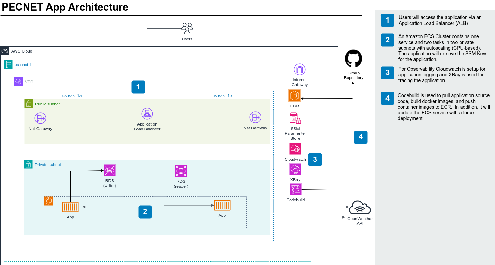

# Weather Application

This setup will deploy the Weather App in a VPC with two Public and Private Subnets across two availablity zones.  The Weather App uses and Application Load Balacner (ALB) and Amazon Elastic Container Service (ECS).

## Architecture
This is the current architecture of the environment.


## Deploying the Application
### Build and Push the Docker Image:

#### Build your Docker image:
```bash
docker build -t thomasliddledba/weather-app .
```
#### Tag and push the image to DockerHub or Amazon ECR:
```bash
docker push thomasliddledba/weather-app:latest
```
## Deploy the CloudFormation Template:
### Use the AWS Management Console or AWS CLI to deploy the ecs_weather_app.yaml template:
Note > You will need to configure your `awscli` client for the aws commands in this section.
```bash
aws cloudformation create-stack --stack-name PcNetAppStack --template-body file://infra/cloudformation.yaml --capabilities CAPABILITY_IAM --capabilities CAPABILITY_NAMED_IAM --parameters ParameterKey=PcNetAppApiKey,ParameterValue=$(cat .apikey) ParameterKey=ContainerImage,ParameterValue=$(cat .dockerimage)
```
- Wait about 6-10 minutes for the stack to complete the creation process.
- Access the Application:
```bash
aws cloudformation describe-stacks --query "Stacks[?StackName=='PcNetAppStack'][].Outputs[?OutputKey=='ALBEndpoint'].OutputValue" --output text
```

### Update Stack
```bash
aws cloudformation update-stack --stack-name PcNetAppStack --template-body file://infra/cloudformation.yaml --capabilities CAPABILITY_IAM --capabilities CAPABILITY_NAMED_IAM --parameters ParameterKey=PcNetAppApiKey,ParameterValue=$(cat .apikey) ParameterKey=ContainerImage,ParameterValue=$(cat .dockerimage)
```

## Test Locally
1. Copy the API Key for OpenWeather.co.uk web site (signup required)
2. Create/Paste the API Key in the `.apikey` file
3. `streamlit run app/app.py`
4. If not already open, go to `http://localhost:8501` in your web browser.


## Test in AWS
Once the stack is deployed, you can access the Weather App through the public IP assigned to the ALB.
Run the following command to get the URL:
```bash
aws cloudformation describe-stacks --query "Stacks[?StackName=='WeatherAppStack'][].Outputs[?OutputKey=='ALBEndpoint'].OutputValue" --output text
```


aws cloudformation create-stack --stack-name PcNetAppStack --template-body file://infra/cicd.yaml --capabilities CAPABILITY_IAM --capabilities CAPABILITY_NAMED_IAM --parameters ParameterKey=GitHubRepoName,ParameterValue=$(cat .githubreponame) ParameterKey=GitHubBranchName,ParameterValue=$(cat .githubbranchname) ParameterKey=GitHubToken,ParameterValue=$(cat .githubtoken)